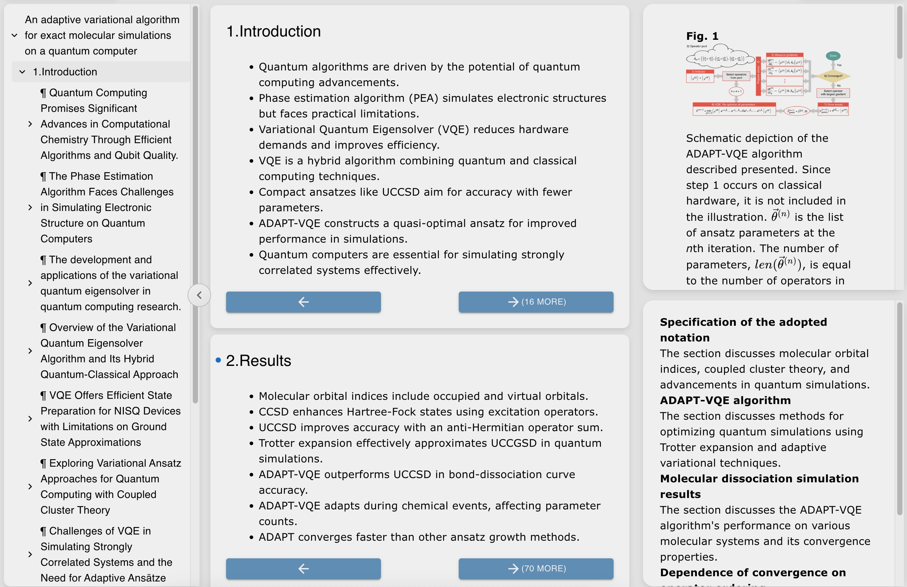

# TreeReader: A Hierarchical Academic Paper Reader Powered by Language Models

## Access TreeReader

Just replace "arxiv" by "trxiv" in any arXiv link! Example: https://arxiv.org/pdf/2506.05536 -> https://trxiv.org/pdf/2506.05536

TreeReader is also accessible by [Uploading PDF](https://worker.treer.ai/upload), installing the [browser extension](https://chromewebstore.google.com/detail/treereader/nhgffkcciononplndadobbkoomkjknkm).

## Source code

The source code of TreeReader is distributed in two repos

- [Forest](https://github.com/EvoEvolver/Forest)
- [SuperReader](https://github.com/EvoEvolver/SuperReader)
